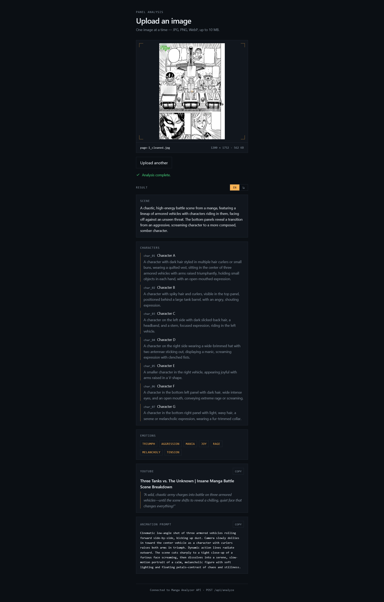

# 🎭 Manga Analyzer

### Turn manga panels into structured AI insights.

Analyze manga images with AI and instantly generate:

**Scene Analysis · Characters · Emotions · YouTube Content · Animation Prompts**

<p align="center">
  
</p>

<p align="center">
  <a href="YOUR_DEMO_URL">🚀 Live Demo</a>
  ·
  <a href="YOUR_REPO_URL">📦 Repository</a>
  ·
  <a href="README_FA.md">🇮🇷 فارسی</a>
</p>

---

## Overview

Manga Analyzer is a lightweight AI-powered web application designed to analyze manga images using a vision-capable language model.

Upload a manga image and the application analyzes:

- Scene
- Characters
- Emotions
- YouTube content
- Animation prompts

The current version focuses on a simple workflow:

**Upload → Analyze → Explore**

---

## ✨ Features

| | Feature | Description |
|---|---|---|
| 🖼️ | Image Analysis | Understand manga scenes and panels |
| 👤 | Character Analysis | Identify and describe characters |
| ❤️ | Emotion Analysis | Extract the main emotions |
| 📺 | YouTube Content | Generate titles and hooks |
| 🎥 | Animation Prompt | Create cinematic animation prompts |

---

## ⚡ How It Works

```text
        🖼️ Manga Image
              │
              ▼
        🤖 Vision Model
              │
              ▼
      🧠 Scene Understanding
              │
       ┌──────┼──────┐
       ▼      ▼      ▼
    👤      ❤️      📺
Characters Emotions YouTube
              │
              ▼
          🎥 Animation
             Prompt
```

---

## 🏗️ Architecture

```text
Manga Image
     │
     ▼
React Frontend
     │
     │ POST /api/analyze
     ▼
FastAPI Backend
     │
     ▼
OpenRouter
     │
     ▼
MiniMax M3
     │
     ▼
Structured JSON
     │
     ▼
React UI
```

---

## 🛠️ Tech Stack

### Frontend


### Backend


### AI


---

## 📁 Project Structure

```text
manga-analyzer/
├── frontend/
│   ├── src/
│   │   ├── App.jsx
│   │   └── ...
│   ├── package.json
│   └── ...
│
├── backend/
│   ├── app/
│   │   ├── main.py
│   │   └── api/
│   │       └── analyze.py
│   │
│   ├── .env
│   ├── .env.example
│   ├── requirements.txt
│   └── .gitignore
│
├── screenshots/
│   └── demo.png
│
├── README.md
└── README_FA.md
```

---

## 🚀 Getting Started

### Requirements

- Python 3.10+
- Node.js 18+
- OpenRouter API key

---

### Backend

Navigate to the backend directory:

```bash
cd backend
```

Create a virtual environment:

```bash
python -m venv .venv
```

Activate the virtual environment on Windows:

```bash
.venv\Scripts\activate
```

Install dependencies:

```bash
pip install -r requirements.txt
```

---

### Environment Variables

Create a `.env` file inside `backend/`:

```env
OPENROUTER_API_KEY=your_openrouter_api_key
AI_MODEL=minimax/minimax-m3:free
```

Do not commit your `.env` file to Git.

---

### Run the Backend

```bash
uvicorn app.main:app --reload
```

Backend:

```text
http://127.0.0.1:8000
```

FastAPI documentation:

```text
http://127.0.0.1:8000/docs
```

---

### Frontend

Open another terminal:

```bash
cd frontend
```

Install dependencies:

```bash
npm install
```

Start the development server:

```bash
npm run dev
```

Frontend:

```text
http://localhost:5173
```

---

## 🤖 AI Pipeline

```text
Image
  ↓
Image Processing
  ↓
FastAPI
  ↓
OpenRouter
  ↓
MiniMax M3
  ↓
JSON Analysis
  ↓
Frontend
```

---

## 📦 Example Output

```json
{
  "scene": "A three-panel manga sequence showing a dramatic moment between two characters.",

  "characters": [
    {
      "name": "Young Man",
      "description": "A young man with messy hair wearing a suit jacket."
    },
    {
      "name": "Young Woman",
      "description": "A young woman with shoulder-length hair and an emotional expression."
    }
  ],

  "emotions": [
    "intensity",
    "desperation",
    "relief",
    "affection"
  ],

  "youtube_hook": "After their explosive argument, one simple embrace says everything words couldn't!",

  "youtube_title": "When Words Fail, This Happens",

  "animation_prompt": "A cinematic animation sequence following the characters through the emotional scene."
}
```

---

## 🌐 Language Support

The primary analysis is first generated in English.

The interface supports English and Persian, providing a localized analysis experience for both languages.

---

## 📌 Project Status

**Portfolio MVP**

Manga Analyzer is currently a lightweight portfolio project focused on demonstrating the core AI image-analysis workflow.

The current version intentionally keeps the architecture simple and focused.

---

## 🔮 Future Possibilities

Possible future improvements include:

- Multiple page analysis
- OCR
- Dialogue extraction
- Panel detection
- Character consistency
- Story context
- Additional languages
- Batch analysis
- Video generation

These features are outside the scope of the current MVP.

---

## 🔐 Security

The OpenRouter API key must never be exposed in the frontend.

The intended architecture is:

```text
React
  ↓
FastAPI
  ↓
OpenRouter
  ↓
AI Model
```

The API key remains on the backend.

---

## 📄 License

This project is licensed under the MIT License.
See the [LICENSE](LICENSE) file for details.