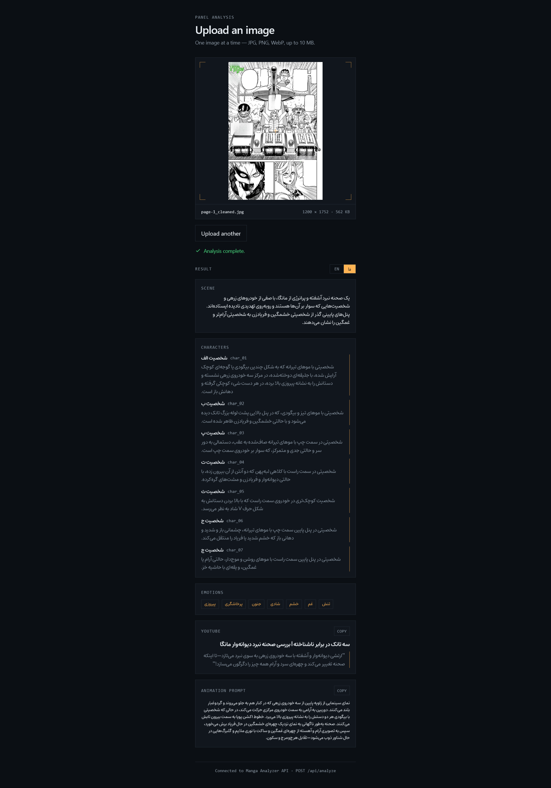

# 🎭 Manga Analyzer

### تبدیل پنل‌های مانگا به تحلیل‌های ساختاریافته با هوش مصنوعی

تصاویر مانگا را با هوش مصنوعی تحلیل کنید و به‌صورت لحظه‌ای دریافت کنید:

**تحلیل صحنه · شخصیت‌ها · احساسات · محتوای یوتیوب · پرامپت انیمیشن**

<p align="center">
  
</p>

<p align="center">
  <a href="YOUR_DEMO_URL">🚀 نسخه آنلاین</a>
  ·
  <a href="YOUR_REPO_URL">📦 مخزن پروژه</a>
  ·
  <a href="README.md">🇬🇧 English</a>
</p>

---

## معرفی

Manga Analyzer یک وب‌اپلیکیشن سبک و مبتنی بر هوش مصنوعی است که برای تحلیل تصاویر مانگا با استفاده از یک مدل زبانی دارای قابلیت بینایی طراحی شده است.

تصویر مانگا را آپلود کنید تا برنامه موارد زیر را تحلیل کند:

- صحنه
- شخصیت‌ها
- احساسات
- محتوای مناسب برای یوتیوب
- پرامپت انیمیشن

نسخه فعلی روی یک روند ساده تمرکز دارد:

**آپلود → تحلیل → مشاهده نتیجه**

---

## ✨ قابلیت‌ها

| | قابلیت | توضیحات |
|---|---|---|
| 🖼️ | تحلیل تصویر | درک صحنه‌ها و پنل‌های مانگا |
| 👤 | تحلیل شخصیت | شناسایی و توصیف شخصیت‌ها |
| ❤️ | تحلیل احساسات | استخراج احساسات اصلی صحنه |
| 📺 | محتوای یوتیوب | تولید عنوان و Hook |
| 🎥 | پرامپت انیمیشن | تولید پرامپت سینمایی برای انیمیشن |

---

## ⚡ نحوه کار

```text
        🖼️ تصویر مانگا
              │
              ▼
       🤖 مدل بینایی
              │
              ▼
       🧠 درک صحنه
              │
       ┌──────┼──────┐
       ▼      ▼      ▼
    👤      ❤️      📺
 شخصیت‌ها  احساسات  یوتیوب
              │
              ▼
       🎥 پرامپت انیمیشن
```

---

## 🏗️ معماری

```text
تصویر مانگا
     │
     ▼
React Frontend
     │
     │ POST /api/analyze
     ▼
FastAPI Backend
     │
     ▼
OpenRouter
     │
     ▼
MiniMax M3
     │
     ▼
JSON ساختاریافته
     │
     ▼
React UI
```

---

## 🛠️ تکنولوژی‌ها

### Frontend


### Backend


### AI


---

## 📁 ساختار پروژه

```text
manga-analyzer/
├── frontend/
│   ├── src/
│   │   ├── App.jsx
│   │   └── ...
│   ├── package.json
│   └── ...
│
├── backend/
│   ├── app/
│   │   ├── main.py
│   │   └── api/
│   │       └── analyze.py
│   │
│   ├── .env
│   ├── .env.example
│   ├── requirements.txt
│   └── .gitignore
│
├── screenshots/
│   └── demo.png
│
├── README.md
└── README_FA.md
```

---

## 🚀 راه‌اندازی

### پیش‌نیازها

- Python 3.10+
- Node.js 18+
- OpenRouter API Key

---

### Backend

وارد پوشه Backend شوید:

```bash
cd backend
```

ساخت محیط مجازی:

```bash
python -m venv .venv
```

فعال‌سازی محیط مجازی در Windows:

```bash
.venv\Scripts\activate
```

نصب وابستگی‌ها:

```bash
pip install -r requirements.txt
```

---

### متغیرهای محیطی

یک فایل `.env` داخل پوشه `backend/` ایجاد کنید:

```env
OPENROUTER_API_KEY=your_openrouter_api_key
AI_MODEL=minimax/minimax-m3:free
```

فایل `.env` را در Git قرار ندهید.

---

### اجرای Backend

```bash
uvicorn app.main:app --reload
```

Backend:

```text
http://127.0.0.1:8000
```

مستندات FastAPI:

```text
http://127.0.0.1:8000/docs
```

---

### Frontend

یک ترمینال دیگر باز کنید:

```bash
cd frontend
```

نصب وابستگی‌ها:

```bash
npm install
```

اجرای محیط توسعه:

```bash
npm run dev
```

Frontend:

```text
http://localhost:5173
```

---

## 🤖 روند تحلیل هوش مصنوعی

```text
تصویر
  ↓
پردازش تصویر
  ↓
FastAPI
  ↓
OpenRouter
  ↓
MiniMax M3
  ↓
تحلیل JSON
  ↓
Frontend
```

---

## 📦 نمونه خروجی

```json
{
  "scene": "A three-panel manga sequence showing a dramatic moment between two characters.",

  "characters": [
    {
      "name": "Young Man",
      "description": "A young man with messy hair wearing a suit jacket."
    },
    {
      "name": "Young Woman",
      "description": "A young woman with shoulder-length hair and an emotional expression."
    }
  ],

  "emotions": [
    "intensity",
    "desperation",
    "relief",
    "affection"
  ],

  "youtube_hook": "After their explosive argument, one simple embrace says everything words couldn't!",

  "youtube_title": "When Words Fail, This Happens",

  "animation_prompt": "A cinematic animation sequence following the characters through the emotional scene."
}
```

---

## 🌐 پشتیبانی از زبان

تحلیل اصلی ابتدا به زبان انگلیسی تولید می‌شود.

رابط کاربری دارای گزینه زبان انگلیسی / فارسی است و امکان ارائه تحلیل به زبان فارسی توسعه داده شده.

---

## 📌 وضعیت پروژه

**Portfolio MVP**

Manga Analyzer در حال حاضر یک پروژه سبک و نمونه‌کار است که روی نمایش قابلیت تحلیل تصویر با هوش مصنوعی تمرکز دارد.

نسخه فعلی عمداً با معماری ساده و متمرکز طراحی شده است.

---

## 🔮 توسعه‌های احتمالی

برخی قابلیت‌هایی که می‌توانند در آینده به پروژه اضافه شوند:

- تحلیل چند صفحه
- OCR
- استخراج دیالوگ
- تشخیص پنل‌ها
- حفظ ثبات شخصیت‌ها
- درک Context داستان
- پشتیبانی از زبان‌های بیشتر
- تحلیل گروهی تصاویر
- تولید ویدئو

این قابلیت‌ها در محدوده نسخه فعلی MVP قرار ندارند.

---

## 🔐 امنیت

کلید OpenRouter نباید هیچ‌وقت در Frontend قرار بگیرد.

معماری مورد نظر:

```text
React
  ↓
FastAPI
  ↓
OpenRouter
  ↓
AI Model
```

کلید API فقط در Backend نگهداری می‌شود.

---

## 📄 لایسنس

این پروژه تحت لایسنس MIT منتشر شده است.
برای جزئیات بیشتر فایل [LICENSE](LICENSE) را مشاهده کنید.